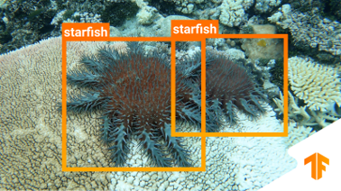

## Project 2 - Protect the Great Barrier Reef



# IMPORTANT
Our code was developed via Live Share in VS Code, meaning the person that commits is not meaningful.
Both students contributed equally to the code.

# Team08
- David Unger (st172353)
- Nick Wagner (st175644)

# How to run the code
## Clone the repository "dl-lab-team08" to the GPU server wherever you want.
```sh
git clone https://github.tik.uni-stuttgart.de/iss/dl-lab-21w-team08.git
```

## Download the following dataset with downscaled images. (3GB) 
   https://drive.google.com/uc?id=1pJM8yoVMKrptXCZcLT26J5R7MFLHIzo9

## Two alternatives to run the code:<br />

EITHER use the shell script that can be found here, update the dataset path and run the sbatch command with it: 
```sh
/misc/home/RUS_CIP/st175644/GBR.sh
```
  OR create your own shell script and change the dataset path in the last line marked with "-p":
 ```sh
#!/bin/bash -l

# Slurm parameters
#SBATCH --job-name=T8_GBR
#SBATCH --output=job_name-%j.%N.out
#SBATCH --time=1-00:00:00
#SBATCH --gpus=1

# Activate everything you need
module load cuda/11.2
# Run your python code
cd dl-lab-21w-team08/GBR_starfish_detection
python3 main.py --wandb_model={"New"} --dataset_slice_end=23500 -p="/misc/home/RUS_CIP/st175644/GBR_dataset/"
```
## If anything is unclear, check ```/misc/home/RUS_CIP/st175644```. Enjoy :-)
