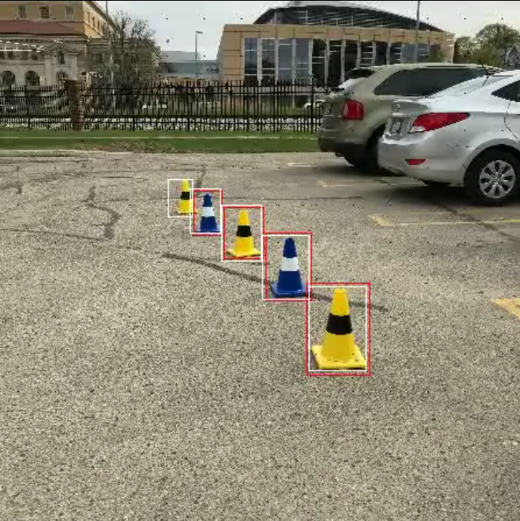

## Project 2b - Traffic cone detection



# IMPORTANT
Our code was developed via Live Share in VS Code, meaning the person that commits is not meaningful.
Both students contributed equally to the code.

# Team08
- David Unger (st172353)
- Nick Wagner (st175644)

# How to run the code

## Training
Download the traffic cone dataset:<br />

```
gdown https://drive.google.com/uc?id=1kSQfEg4kkch6npr9cZmHJx6CiZsoZjFZ
```
Unpack the dataset (select the correct path)<br />
```
unzip -u "/content/cones_multi_class.zip" -d "/content/";
````
Clone the repository and navigate to the main.py file.<br />
Run the main file by passing the path the the dataset:<br />
````
python main.py -p="/content/cones_multi_class/"
````


<br /><br />
## Training Parameters
The parameters can be adapted in the config-defaults.yaml file.<br />
The main parameters are:
- epochs: how many epochs the algorithm shall train
- grid_size: if the YOLO network shall use a 7x7 or 14x14 grid
- loss function: "custom" uses weighted binary cross entropy for the objectness and e.g. MAE for the bounding boxes. "YOLO" uses the original loss function form the YOLO paper

This dataset was provided by the GreenTeam, the formula student racing team from the University of Stuttgart.
<br /><br />
## Training in Colab
Just open the Traffic_Cone_Colab.ipynb in Google colab and run all cells.<br />
Maybe you need to pass your own wandb login into cell 7.
<br /><br />

## Evaluation
Evaluation can be done via WandB, because all relevant metrics (IOU, gIOU, TP-rate, TN-rate) are passed to WandB.<br />
In addition one can create a video of the test data with the oredictions of the model.
1) Select evaluation parameters (wandb_run and bbox_confidence_threshold) in config-defaults.yaml.
2) run evaluate.py 
3) the program will download the model and store a video as result


## Troubleshooting
If you receive a OOM error or a semaphore failure, you can try to reduce batch size or the shuffle buffer of ds_train.