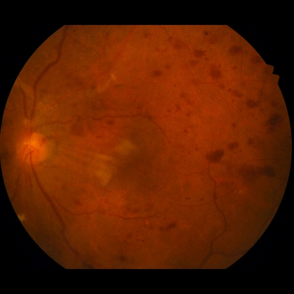

# Project 1 - Diabetic Retinopathy Detection
[Paper](https://github.com/nickpwagner/dl-lab-projects/blob/main/documents/paper/diabetic_retinopathy_detection.pdf)



<br/>

# Setup
### Download the data set:
- https://drive.google.com/uc?id=1TjyYDws_yFafhVtq2r5itv9SU1EnmXjg
### Clone the repo, setup wandb, then run:
```sh
python main.py --train=True --epochs=20 -p="your_path/IDRID_dataset/"
```
